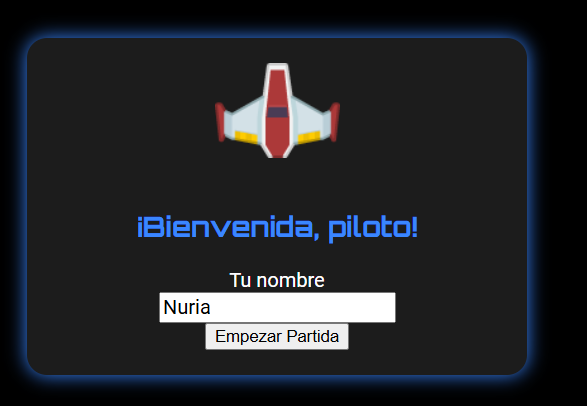
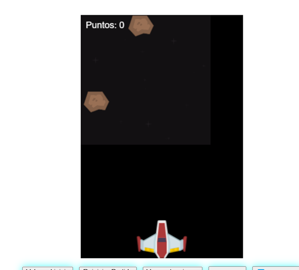
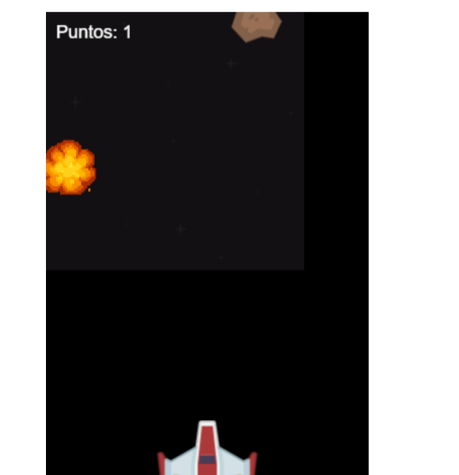
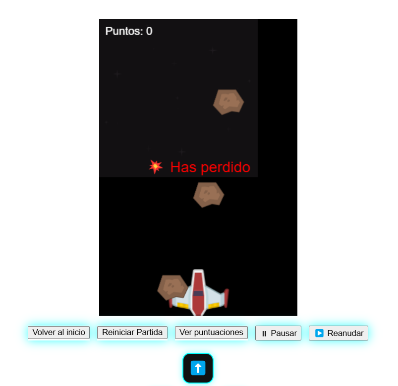
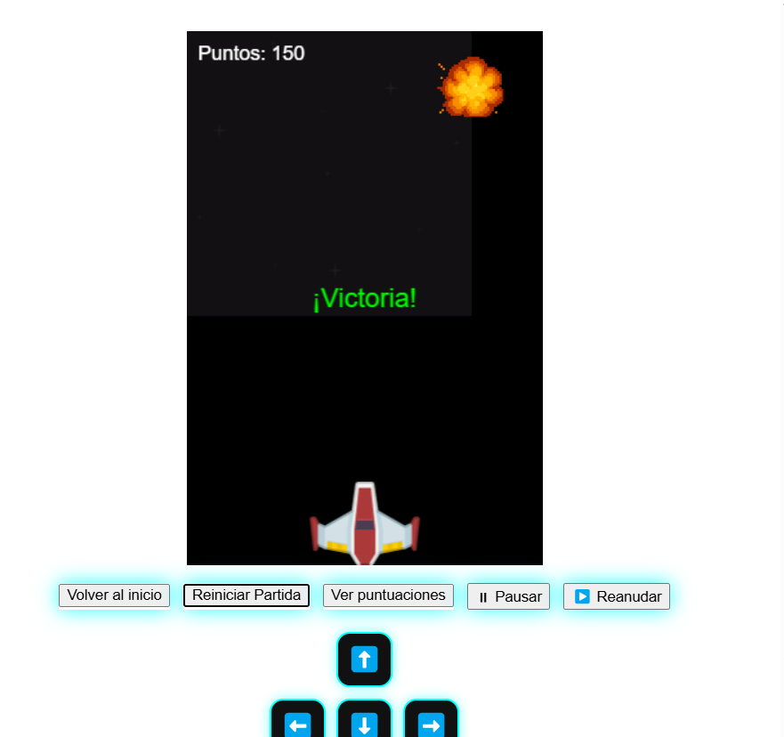
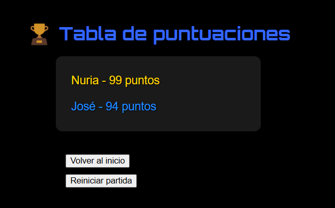
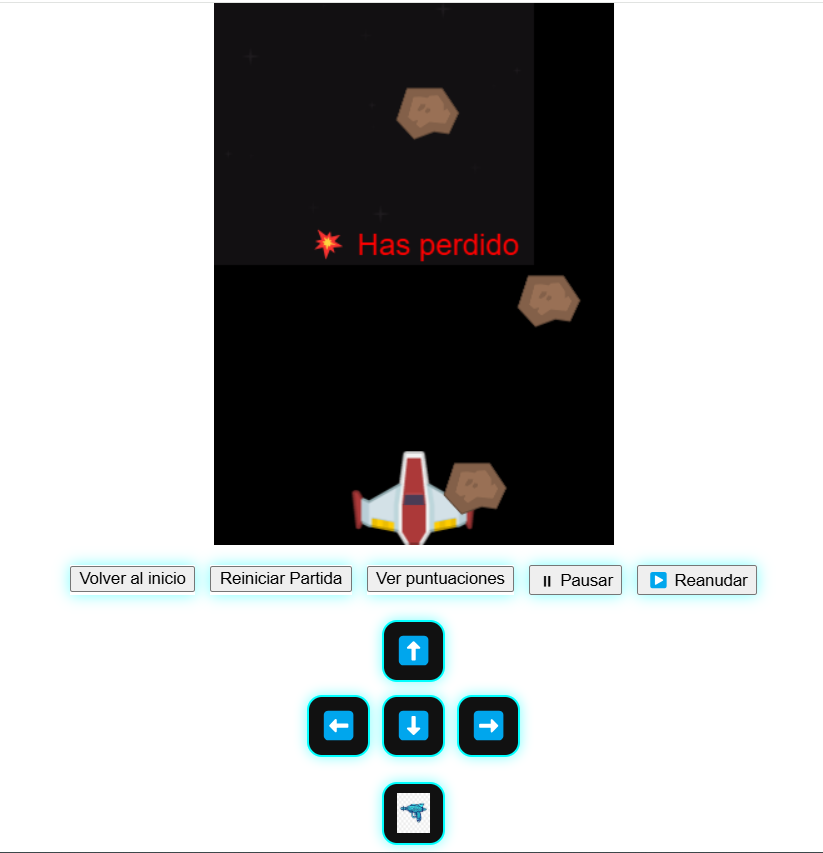

# Guardianes de la Galaxia 🚀

Juego arcade espacial creado con **Ionic + Angular + Phaser** donde pilotas una nave para destruir asteroides y sumar puntos.

---

## ✨ Características del juego

- ⬆️ Mueve tu nave de izquierda a derecha
- ⛳ Dispara pulsando la barra espaciadora o el botón en pantalla
- 🚨 Esquiva los asteroides o perderás la partida
- ✨ Cada asteroide destruido suma **+1 punto**
- 🔄 Puedes **pausar**, **reanudar** o **reiniciar** el juego en cualquier momento
- 📈 Guarda tu **mejor puntuación** con `localStorage`

---

## 🎮 Mecánicas implementadas

| Requisito                                                      | Estado     |
|---------------------------------------------------------------|------------|
| Mover nave izquierda/derecha                                  | ✅ Listo |
| Disparar con barra espaciadora                                | ✅ Listo |
| Disparos destruyen asteroides                                 | ✅ Listo |
| Colisión nave-asteroide reinicia partida (con confirmación)   | ✅ Listo |
| Cada asteroide destruido suma 1 punto                         | ✅ Listo |
| Mostrar puntuación durante la partida                         | ✅ Listo |
| Guardar máxima puntuación en localStorage                     | ✅ Listo |
| Botones de reiniciar, pausar y reanudar                       | ✅ Listo |

---

## 📂 Estructura de pantallas

- `Inicio` ✨: introducción del nombre y comenzar partida
- `Juego` 🚀: canvas con la nave, asteroides, disparos, botones de control
- `Puntuaciones` 🌟: tabla de máximas puntuaciones por jugador (guardadas en `localStorage`)

---

## 📊 Tecnologías usadas

- [x] Ionic + Angular
- [x] Phaser 3 (motor de videojuegos)
- [x] SCSS personalizado
- [x] localStorage para persistencia

---

## 🔧 Instrucciones de uso

1. Clona el repositorio:
   ```bash
   git clone https://github.com/NuriaRodvin/ICC0006-UF3-PR01-nuriarodriguez.git
   ```
2. Instala dependencias:
   ```bash
   npm install
   ```
3. Ejecuta la app:
   ```bash
   ionic serve
   ```

---

## 📸 Capturas del juego

A continuación se muestran algunas capturas representativas del juego *Guardianes de la Galaxia*:

### 🛫 Pantalla de inicio
El jugador introduce su nombre antes de comenzar la partida.



---

### 🚀 Juego en curso
La nave se mueve mientras caen los asteroides y el jugador puede disparar.



---

### 🔫 Disparo a asteroide
Un disparo impacta en un asteroide y suma 1 punto.



---

### 💥 Colisión con asteroide
Al colisionar con un asteroide, se muestra el mensaje de derrota y se pregunta si desea reiniciar.



---

### 🏆 Victoria
Cuando se alcanzan 150 puntos, aparece el mensaje de victoria.



---

### 📊 Tabla de puntuaciones
Se muestran los jugadores y su máxima puntuación guardada en localStorage.



---

### 🕹️ Controles extra
Botones para pausar, reanudar, reiniciar y volver al inicio mientras se juega.




---

## 🌟 Autor

**Nuria Rodríguez Vindel**  
Proyecto realizado para la UF3 de la asignatura **ICC0006**


---

> “En el espacio nadie puede oír tus gritos... pero sí tus puntuaciones altas.” 🚀

